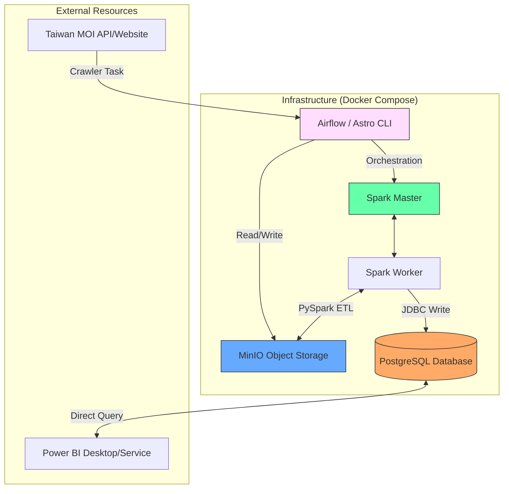
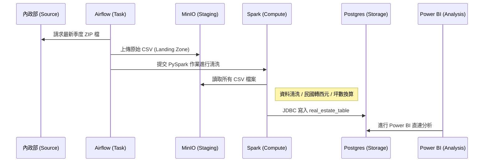
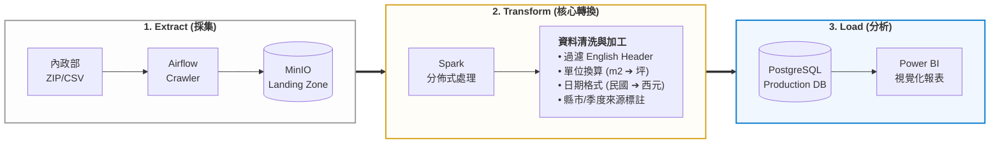
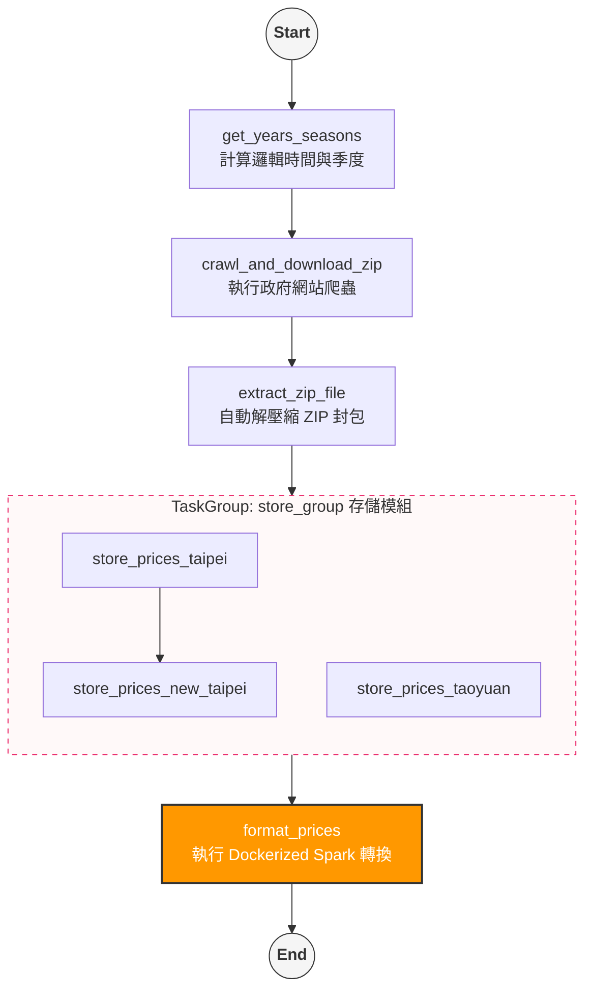

# Real Estate ETL - 台灣不動產房地產實價登錄自動化平台

這是一個基於 **Apache Airflow (Astro CLI)** 與 **Apache Spark** 的自動化 ETL 平台，專門處理台灣內政部不動產實價登錄資料，原
始資料從政府官網爬取後，存儲於 MinIO 物件存儲中，再由 Spark 進行資料清洗與轉換，最後載入 PostgreSQL 資料庫，並透過Power BI 進行分析。


---

## 🚀 功能特色 | Features

### 核心價值與效益 | Core Value & Benefits
- ✅ **數據自動更新** 不用手動下載，系統自動追蹤內政部最新季度成交數據，確保資料永遠維持在最新狀態。
- ✅ **統一數據標準化**: 調整民國時間格式為西元格式，以便後續分析，並將每平方公尺單價換算為業界習慣每坪單價，讓數據更具可比性。
- ✅ **跨年度整合**: 將分散的原始檔案自動合併為單一歷史大數據庫，輕鬆進行長年期的房市趨勢追蹤。
- ✅ **專業分析即戰力**: 數據經過深度清洗與結構化，可直接串接 Power BI，數分鐘內即可生成專業的報表。

### 管理功能 | Management Features
- ✅ **透明的資料追蹤**: 每筆數據均標註來源年份與季度，確保分析結果具有可追溯性。
- ✅ **高效的清洗引擎**: 資料清洗大幅減少後續以Power BI產生分析資料前所需作的資料預處理的時間。


---

## 📂 專案結構 | Project Structure

```text
airflow_realEstate/
├── dags/
│   └── realestate.py          # Airflow DAG: 定義完整 ETL 流程
├── spark/
│   ├── master/                # Spark Master 配置
│   ├── worker/                # Spark Worker 配置
│   └── notebooks/
│       └── realestate_transform/
│           └── realestate_transform.py  # Spark 核心轉換邏輯
├── streamlit-app/
│   └── app.py                 # (已停用) 原 Streamlit 佔位程式
├── PowerBI/                   # (建議) 存放 Power BI (.pbix) 檔案之目錄
├── docker/                    # 基礎設施 Dockerfile 與配置
├── include/                   # 自定義輔助函式或靜態檔案
├── airflow_settings.yaml      # Airflow 連線與變數配置
├── docker-compose.override.yml # 擴充服務 (Postgres, MinIO, Spark)
├── requirements.txt           # Python 依賴套件
└── packages.txt               # OS 層級相依套件
```

---

## 🛠️ 安裝步驟 | Installation Steps

### 1. 複製專案與準備環境 | Clone and Setup
適用windows 10 環境

#### 1.1 下載專案
git clone <your-repo-url>
cd airflow_realEstate

#### 1.2 確保已安裝 Astro CLI
https://www.astronomer.io/docs/astro/cli/install-cli


### 2. 配置環境變數 | Configuration
請建立或編輯 `.env` 檔案，請參考.env.example

### 3. 核心套件
minio==7.2.14
apache-airflow-providers-docker==4.0.0
pyspark==3.5.6
python==3.10.10

### 4. 建置必要的 Docker 映像檔

在執行 `astro dev start` 之前,必須先建置以下映像檔:
```bash
# 建置 Spark Master
docker build -t airflow/spark-master ./spark/master

# 建置 Spark Worker
docker build -t airflow/spark-worker ./spark/worker

# 建置 Real Estate 應用程式
docker build -t airflow/realestate-app ./spark/notebooks/realestate_transform
```

### 5. 啟動系統 | Start the Platform
使用 Astro CLI 啟動所有容器服務（Airflow, Spark, Postgres, MinIO）：
```bash
astro dev start
```
啟動後可透過以下介面管理系統：
- **Airflow UI**: [http://localhost:8080](http://localhost:8080) (Account: `admin` / `admin`)
- **MinIO Console**: [http://localhost:9001](http://localhost:9001)
- **Spark Master**: [http://localhost:8081](http://localhost:8081)

### 5. 執行任務 | Run the Task
1. 登入 Airflow UI。
2. 啟動名為 `realEstate` 的 DAG。
3. 監控任務執行，完成後資料將匯入 PostgreSQL 的 `real_estate_table` 表中。

---

## 🏗️ 系統架構與資料流程 | Architecture & Data Flow

### 1. 系統架構圖 | System Architecture
本專案採用 **Docker 容器化分層架構**，將各個元件解耦，並由 Airflow 進行全局調度。



### 2. 資料生命週期 | Data Lifecycle (ETL Flow)



### 3. ETL 核心管線設計 | Core ETL Pipeline Design




### 4. Airflow 工作流設計 | Airflow DAG Workflow

本系統透過 **Apache Airflow** 進行自動化排程與監控，以下為 DAG 的任務依賴關係圖：



#### 📅 排程配置說明 | Scheduling Configuration
| 設定項目 | 內容 | 說明 |
| :--- | :--- | :--- |
| **DAG ID** | `realEstate` | 核心不動產 ETL 任務標識 |
| **Schedule** | `0 4 2 * *` | **每月 2 號凌晨 04:00** 自動觸發 |
| **Catchup** | `False` | 僅執行當前排程，不補執行歷史任務 |
| **Max Active Runs** | `1` | 同步僅允許一個實例運行，防止資源競爭 |
| **Retries** | `1` | 任務失敗後自動重試 1 次 |
| **Retry Delay** | `5 Seconds` | 失敗後間隔 5 秒進行重試 |
| **Timeout** | `20 Minutes` | 完整流程超時限制為 20 分鐘 |


